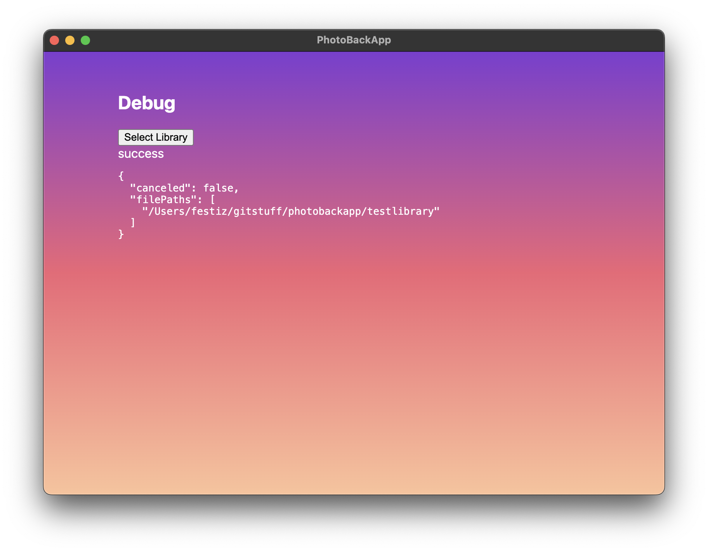

# Desktop App & Agent

> [!NOTE]
> This is a early "works on my computer" stage and thus have only been tested on Mac OS Sonoma on my sweet 2021 16" MBP M1.

## State:

Current state as of 2024-01-13 at 01.52.00

## Desktop App idea:

- Shows upload statuses(dashboard-like content)
- Let's user configure "inbox" and "library"
- Supports user authentication

## Agent idea:

- Hosts node API server for Phone App
- Always running
- mdns/bonjour-responsible

# Current solution

Desktop app implemented as an electron app that hosts both nodejs and ui.

# Status

Not MVP-complete

# Get started developing

> [!IMPORTANT]
> Install `yarn` and `nodejs` before proceeding

- `yarn`
- `yarn start # or dev`
